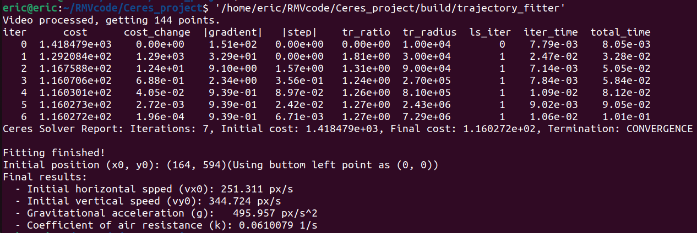

# RMV-task3
## Result


## Directory Tree
```.
├── build
│   ├── CMakeCache.txt
│   ├── CMakeFiles
│   │   ├── 3.22.1
│   │   │   ├── CMakeCCompiler.cmake
│   │   │   ├── CMakeCXXCompiler.cmake
│   │   │   ├── CMakeDetermineCompilerABI_C.bin
│   │   │   ├── CMakeDetermineCompilerABI_CXX.bin
│   │   │   ├── CMakeSystem.cmake
│   │   │   ├── CompilerIdC
│   │   │   │   ├── a.out
│   │   │   │   ├── CMakeCCompilerId.c
│   │   │   │   └── tmp
│   │   │   └── CompilerIdCXX
│   │   │       ├── a.out
│   │   │       ├── CMakeCXXCompilerId.cpp
│   │   │       └── tmp
│   │   ├── cmake.check_cache
│   │   ├── CMakeDirectoryInformation.cmake
│   │   ├── CMakeError.log
│   │   ├── CMakeOutput.log
│   │   ├── CMakeTmp
│   │   ├── Makefile2
│   │   ├── Makefile.cmake
│   │   ├── progress.marks
│   │   ├── TargetDirectories.txt
│   │   └── trajectory_fitter.dir
│   │       ├── build.make
│   │       ├── cmake_clean.cmake
│   │       ├── compiler_depend.internal
│   │       ├── compiler_depend.make
│   │       ├── compiler_depend.ts
│   │       ├── DependInfo.cmake
│   │       ├── depend.make
│   │       ├── flags.make
│   │       ├── link.txt
│   │       ├── main.cpp.o
│   │       ├── main.cpp.o.d
│   │       └── progress.make
│   ├── cmake_install.cmake
│   ├── compile_commands.json
│   ├── Makefile
│   └── trajectory_fitter  //Executable File
├── CMakeLists.txt 
├── Final_Results.png //Final Results
├── main.cpp //Src code
└── video.mp4
```
## What caused mistake?
I misunderstood the direction for g, and this brought mistake when I limit the boundary for g and k.
## How to solve it?
Firstly, I moved the coordinate system for the frame, moving (0,0) from top left to buttom left. This is easily achieved by `720.0-point.y`. 
Besides, I figure out the direction of each vector, like vy0 and g. Now no matter which direction they are, the showed result will be positive. 
Thank you for reminding me of my mistake! Hoping my result this time right!

